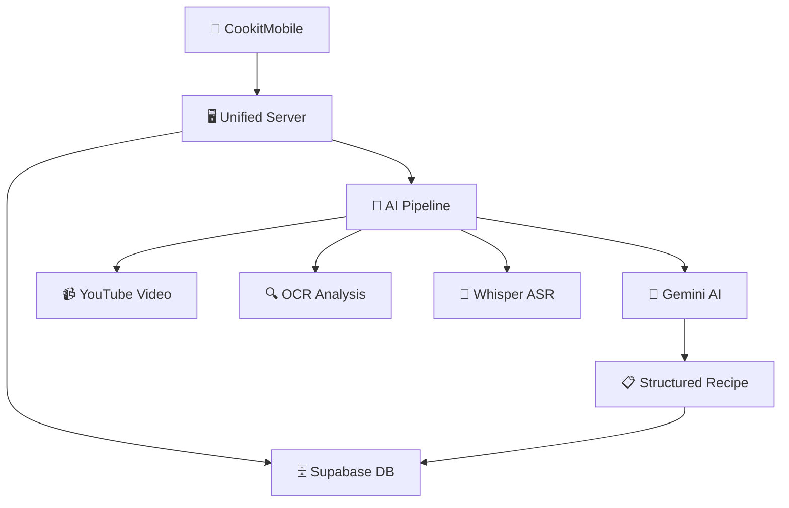
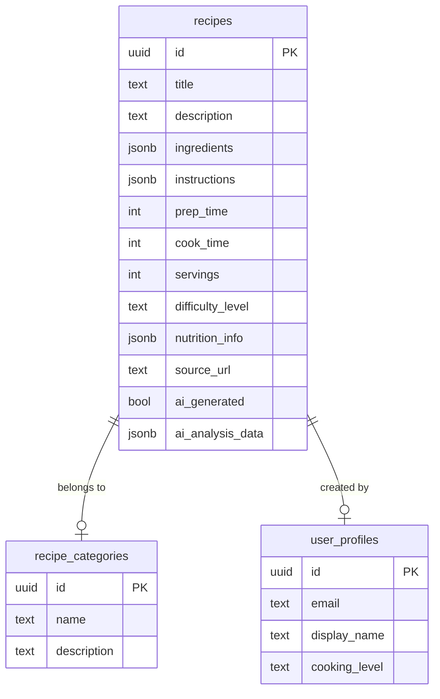
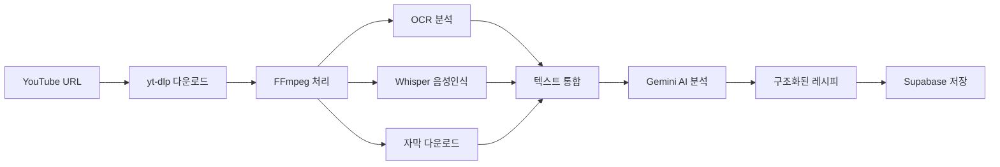

# 🍳 CookIt - AI 스마트 요리 플랫폼

> YouTube 요리 영상을 AI로 분석하여 자동으로 레시피를 생성하는 차세대 요리 플랫폼

[]()
[]()
[]()
[]()

## 🎯 핵심 기능

### 🤖 AI 자동 레시피 생성
- **YouTube 영상 분석**: Shorts, 일반 영상 모두 지원
- **멀티모달 AI**: OCR + 음성인식 + AI 요약 통합
- **구조화된 레시피**: 재료, 단계, 영양정보 자동 분류

### 📱 스마트 모바일 앱
- **직관적 UI/UX**: Expo Router 기반 네비게이션
- **개인화 경험**: Supabase Auth 사용자 인증
- **실시간 동기화**: 레시피 저장 및 공유

### 🗄️ 강력한 백엔드
- **통합 API 서버**: 기존 API + AI 기능 하나로 통합
- **정규화된 DB**: 1:N 관계로 유연한 레시피 데이터 관리
- **실시간 데이터**: Supabase PostgreSQL

## 📊 시스템 아키텍처



## 🚀 빠른 시작

### 📋 사전 요구사항

```bash
# Node.js 18.x 이상
node --version

# Python 3.8+ (AI 기능용)
python --version

# FFmpeg (영상 처리용)
ffmpeg -version
```

### 1️⃣ 프로젝트 클론

```bash
git clone https://github.com/your-org/Cookit.git
cd Cookit
```

### 2️⃣ 서버 설정 및 실행

```bash
cd Server
npm install

# 환경변수 설정
cp .env.example .env
# .env 파일에 실제 API 키들 입력

# 서버 시작
npm start
# 🚀 http://localhost:3000 에서 실행
```

### 3️⃣ 모바일 앱 실행

```bash
cd CookitMobile
npm install

# 환경변수 설정
cp .env.example .env
# .env 파일에 Supabase 설정 입력

# 앱 시작
npx expo start
```

## 🛠️ 환경변수 설정

### Server/.env
```env
# 서버 설정
PORT=3000
NODE_ENV=development

# AI 서비스
GEMINI_API_KEY=your_gemini_api_key_here

# 파일 업로드
MAX_FILE_SIZE=100mb
UPLOAD_DIR=./uploads
```

### CookitMobile/.env
```env
# Supabase 설정
EXPO_PUBLIC_SUPABASE_URL=your_supabase_url
EXPO_PUBLIC_SUPABASE_ANON_KEY=your_supabase_anon_key
```

## 📡 API 사용법

### 🎬 YouTube 영상 분석
```bash
curl -X POST http://localhost:3000/api/ai/analyze-youtube \
  -H "Content-Type: application/json" \
  -d '{"url": "https://youtube.com/shorts/jHrcnkPrtCA"}'
```

### 📹 비디오 파일 분석
```bash
curl -X POST http://localhost:3000/api/ai/analyze-video \
  -F "video=@cooking_video.mp4"
```

### 🔍 이미지 OCR
```bash
curl -X POST http://localhost:3000/api/ai/ocr \
  -F "image=@recipe_image.jpg"
```

### 🤖 텍스트 → 레시피 생성
```bash
curl -X POST http://localhost:3000/api/ai/generate-recipe \
  -H "Content-Type: application/json" \
  -d '{"text": "김치찌개 만들기: 김치와 돼지고기를 볶아주세요..."}'
```

## 🏗️ 프로젝트 구조

```
Cookit/
├── 📱 CookitMobile/           # React Native 모바일 앱
│   ├── app/                   # Expo Router 화면들
│   ├── components/            # 재사용 컴포넌트
│   ├── lib/                   # Supabase 클라이언트
│   └── .env.example          # 환경변수 템플릿
│
├── 🖥️ Server/                 # 통합 Node.js 서버
│   ├── routes/               # API 라우터
│   │   ├── ai.js            # AI 기능 API들 🆕
│   │   ├── auth.js          # 인증 API
│   │   ├── recipes.js       # 레시피 CRUD
│   │   └── users.js         # 사용자 관리
│   ├── services/            # AI 서비스 모듈들 🆕
│   │   ├── aiPipelineService.js    # 전체 AI 파이프라인
│   │   ├── geminiService.js        # Gemini AI 연동
│   │   └── ocrService.js           # OCR 처리
│   ├── scripts/             # Python 스크립트들 🆕
│   │   └── whisper_processor.py   # Whisper 음성인식
│   ├── data/                # OCR 훈련 데이터 🆕
│   ├── database/            # DB 스키마 및 마이그레이션 🆕
│   └── uploads/             # 파일 업로드 저장소 🆕
│
├── 📋 .gitignore             # Git 제외 파일들
└── 📖 README.md              # 이 파일
```

## 🗄️ 데이터베이스 스키마

### 📊 ERD 다이어그램



### 🔑 주요 테이블

| 테이블 | 설명 | 특징 |
|--------|------|------|
| `recipes` | 레시피 메인 데이터 | JSONB로 유연한 재료/단계 저장 |
| `recipe_categories` | 레시피 카테고리 | 한식, 중식, 양식 등 |
| `user_profiles` | 사용자 프로필 | Supabase Auth 연동 |

## 🧠 AI 파이프라인 상세

### 📈 처리 흐름



### 🔧 AI 모델 및 도구

| 구성요소 | 기술스택 | 용도 |
|----------|----------|------|
| **OCR** | Tesseract.js | 영상 내 텍스트 추출 |
| **ASR** | OpenAI Whisper | 음성 → 텍스트 변환 |
| **AI 요약** | Google Gemini Pro | 텍스트 → 구조화된 레시피 |
| **영상 처리** | FFmpeg | 프레임 추출, 오디오 분리 |
| **다운로드** | yt-dlp | YouTube 영상/오디오 다운로드 |

## 🧪 테스트

### 🔍 API 상태 확인
```bash
curl http://localhost:3000/api/ai/status
```

### 🏥 헬스 체크
```bash
curl http://localhost:3000/api/ai/health
```

### 📊 샘플 응답
```json
{
  "success": true,
  "recipe": {
    "title": "AI 김치찌개",
    "ingredients": [
      {"name": "신김치", "quantity": "300", "unit": "g"},
      {"name": "돼지고기", "quantity": "200", "unit": "g"}
    ],
    "steps": [
      {"step": 1, "instruction": "김치를 한입 크기로 자르기"},
      {"step": 2, "instruction": "돼지고기와 함께 볶기"}
    ],
    "nutrition": {
      "calories": 280,
      "protein": 25.0,
      "carbs": 12.0
    }
  },
  "metadata": {
    "processingTime": "45초",
    "videoId": "jHrcnkPrtCA"
  }
}
```

## 🛠️ 기술 스택

### 📱 Frontend (Mobile)
- **React Native** 0.70+ with **Expo Router**
- **TypeScript** for type safety
- **Supabase Client** for auth & data
- **Expo Constants** for environment management

### 🖥️ Backend (Server)
- **Node.js** 18.x with **Express** 4.x
- **Supabase** PostgreSQL with RLS
- **Multer** for file uploads
- **Sharp** for image processing

### 🤖 AI/ML Stack
- **Google Gemini Pro** (Text/Vision API)
- **OpenAI Whisper** (Speech Recognition)
- **Tesseract.js** (OCR Engine)
- **FFmpeg** (Video/Audio Processing)
- **yt-dlp** (YouTube Downloader)

### 🗄️ Database
- **Supabase PostgreSQL** with JSONB
- **Row Level Security** (RLS) enabled
- **Real-time subscriptions** ready

## 🚀 배포

### 📱 모바일 앱 (Expo)
```bash
cd CookitMobile
npx eas build --platform all
npx eas submit --platform all
```

### 🖥️ 서버 (Node.js)
```bash
cd Server
npm run build
npm run start:prod
```

## 🤝 협업 가이드

### 🌿 브랜치 전략
- `main`: 프로덕션 배포용
- `develop`: 개발 통합용
- `feature/*`: 새 기능 개발
- `fix/*`: 버그 수정
- `ai/*`: AI 기능 개발

### 📝 커밋 컨벤션
```
feat(ai): YouTube Shorts URL 파싱 지원 추가
fix(mobile): Supabase 환경변수 로딩 오류 수정
docs(readme): API 사용법 예시 추가
refactor(server): AI 서비스 모듈 분리
test(api): 레시피 생성 API 테스트 추가
chore(deps): Expo SDK 50 업그레이드
```

### 🔄 개발 워크플로우
1. **이슈 생성** → GitHub Issues
2. **브랜치 생성** → `feature/issue-number`
3. **개발 진행** → 로컬 테스트
4. **PR 생성** → 코드 리뷰 요청
5. **리뷰 완료** → `develop` 머지
6. **배포 준비** → `main` 머지

## 📈 로드맵

### ✅ 완료된 기능
- [x] AI 영상 분석 파이프라인 구축
- [x] YouTube URL 지원 (일반/Shorts)
- [x] 통합 서버 아키텍처
- [x] Supabase 데이터베이스 설계
- [x] 모바일 앱 기본 구조
- [x] 환경변수 관리 시스템

### 🚧 진행 중
- [ ] 모바일 앱 UI/UX 개발
- [ ] 사용자 인증 플로우
- [ ] 레시피 검색 및 필터링
- [ ] 실시간 알림 시스템

### 🎯 예정 기능
- [ ] 음성 명령 레시피 검색
- [ ] AR 요리 가이드
- [ ] 소셜 기능 (좋아요, 댓글, 공유)
- [ ] 개인화 추천 알고리즘
- [ ] 다국어 지원
- [ ] 영상 녹화 및 업로드

## 🐛 문제 해결

### 🔧 자주 발생하는 문제

<details>
<summary><strong>환경변수가 로드되지 않음</strong></summary>

**증상**: `Cannot read property 'auth' of undefined`

**해결책**:
```bash
# 1. .env 파일 확인
cat .env

# 2. 서버 재시작
npm start

# 3. 캐시 클리어
npx expo start --clear
```
</details>

<details>
<summary><strong>FFmpeg 설치 오류</strong></summary>

**증상**: `ffmpeg not found`

**해결책**:
```bash
# Windows (Scoop)
scoop install ffmpeg

# macOS (Homebrew)
brew install ffmpeg

# Ubuntu
sudo apt update && sudo apt install ffmpeg
```
</details>

<details>
<summary><strong>Whisper 모델 체크섬 오류</strong></summary>

**증상**: `SHA256 checksum does not match`

**해결책**:
```python
# 더 작은 모델로 변경
model = whisper.load_model("base")  # "large-v3" 대신
```
</details>

