# Cookit 시스템 다이어그램 (Mermaid 형식)

이 문서는 [Mermaid.js](https://mermaid.js.org/)를 사용하여 Cookit 프로젝트의 시스템 아키텍처와 주요 기능을 시각화합니다.

---

## 1. 시스템 블록 다이어그램

### 1.1 전체 시스템 아키텍처

```mermaid
graph TB
    subgraph Mobile["Cookit Mobile App (React Native/Expo)"]
        subgraph Features["features/ - Feature Modules"]
            RecipeModule["Recipe Module<br/>(레시피 조회, 검색, 분석)"]
            CommunityModule["Community Module<br/>(게시글, 댓글, 좋아요)"]
            ProfileModule["Profile Module<br/>(프로필, 설정, 히스토리)"]
            RefrigModule["Refrigerator Module<br/>(냉장고 관리, 영수증 OCR)"]
            AuthModule["Auth Module<br/>(인증, OAuth)"]
            NavigationModule["Navigation Module<br/>(탭 네비게이션)"]
            SettingsModule["Settings Module<br/>(앱 설정)"]
        end
        
        subgraph Shared["shared/ - Shared Resources"]
            SharedComponents["Shared Components<br/>(SearchInput, Sort, etc.)"]
            SharedLib["Supabase Client<br/>(lib/supabase.ts)"]
            SharedTypes["Type Definitions<br/>(types/)"]
            NotificationService["Notification Service<br/>(FCM)"]
        end
        
        subgraph VoiceSystem["음성 인식 시스템 (Recipe Module 내부)"]
            Porcupine["PorcupineManager<br/>(Wake Word Detection)"]
            Rhino["RhinoManager<br/>(Intent Recognition)"]
        end
        
        subgraph FeatureServices["Feature Services"]
            RecipeService["recipeService<br/>(recipe/)"]
            RecipeLikesApi["recipeLikesApi<br/>(recipe/)"]
            PostsApi["postsApi<br/>(community/)"]
            PostLikesApi["postLikesApi<br/>(community/)"]
            CommentsApi["commentsApi<br/>(community/)"]
            UserApi["userApi<br/>(profile/)"]
            ReceiptApi["receiptItemsApi<br/>(refrigerator/)"]
        end
    end
    
    subgraph Backend["Backend Server (Node.js/Express)"]
        subgraph RoutesLayer["routes/ - API Routes"]
            AuthRoutes["/api/auth"]
            UserRoutes["/api/users"]
            RecipeRoutes["/api/recipes"]
            UserRecipeRoutes["/api/user-recipes"]
            RecipeLikesRoutes["/api/recipe-likes"]
            UserPostsRoutes["/api/user-posts"]
            RecipeCategoriesRoutes["/api/recipe-categories"]
            ReceiptItemsRoutes["/api/receipt-items"]
            CommentsRoutes["/api/comments"]
            PostLikesRoutes["/api/post-likes"]
            AiRoutes["/api/ai"]
            YoutubeRoutes["/api/youtube"]
            ReceiptListRoutes["/api/receipt-list"]
            RecommendationsRoutes["/api/recommendations"]
        end
        
        subgraph ServicesLayer["services/ - Business Logic"]
            SupabaseService["supabaseService<br/>(DB CRUD)"]
            GeminiService["geminiService<br/>(AI 분석)"]
            AiPipelineService["aiPipelineService<br/>(YouTube 분석 파이프라인)"]
            OcrHandler["ocrHandler<br/>(영수증 OCR)"]
        end
    end
    
    subgraph External["External Services"]
        Supabase["Supabase<br/>(PostgreSQL + Auth + Storage)"]
        Gemini["Google Gemini API<br/>(AI 레시피 분석)"]
        YouTube["YouTube API<br/>(영상 검색)"]
        Picovoice["Picovoice Platform<br/>(Voice AI SDK)"]
        FCM["Firebase Cloud Messaging<br/>(푸시 알림)"]
    end
    
    %% Feature Modules to Feature Services
    RecipeModule --> RecipeService
    RecipeModule --> RecipeLikesApi
    CommunityModule --> PostsApi
    CommunityModule --> PostLikesApi
    CommunityModule --> CommentsApi
    ProfileModule --> UserApi
    RefrigModule --> ReceiptApi
    
    %% Feature Modules to Shared Resources
    Features --> SharedComponents
    Features --> SharedLib
    Features --> SharedTypes
    
    %% Voice System (inside Recipe Module)
    RecipeModule --> VoiceSystem
    VoiceSystem --> Porcupine
    VoiceSystem --> Rhino
    VoiceSystem --> Picovoice
    
    %% Auth and Navigation
    AuthModule --> Features
    NavigationModule --> Features
    
    %% Notification
    NotificationService --> FCM
    
    %% Feature Services to Backend Routes
    RecipeService --> RecipeRoutes
    RecipeLikesApi --> RecipeLikesRoutes
    PostsApi --> UserPostsRoutes
    PostLikesApi --> PostLikesRoutes
    CommentsApi --> CommentsRoutes
    UserApi --> UserRoutes
    ReceiptApi --> ReceiptItemsRoutes
    
    %% Backend Routes to Services
    RoutesLayer --> ServicesLayer
    
    %% Backend Services to External
    ServicesLayer --> Supabase
    ServicesLayer --> Gemini
    RoutesLayer --> YouTube
    RoutesLayer --> Supabase
```

### 1.2 모바일 앱 내부 구조 (리팩토링된 구조)

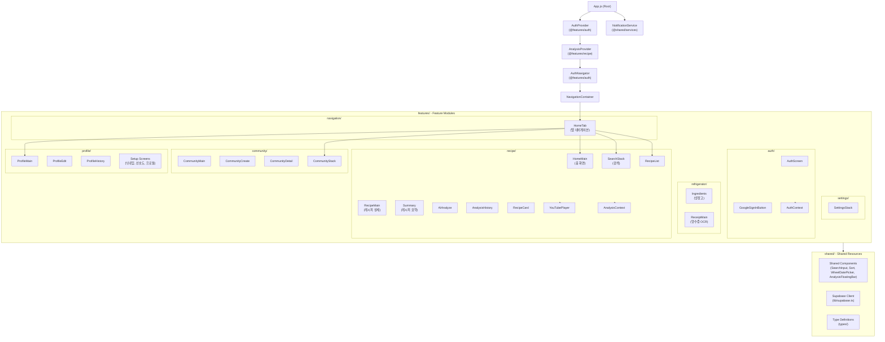
```mermaid
graph TB
    App["App.js (Root)"]
    AuthProvider["AuthProvider<br/>(@features/auth)"]
    AnalysisProvider["AnalysisProvider<br/>(@features/recipe)"]
    NotificationService["NotificationService<br/>(@shared/services)"]
    AuthNavigator["AuthNavigator<br/>(@features/auth)"]
    NavContainer["NavigationContainer"]
    
    subgraph Features["features/ - Feature Modules"]
        subgraph AuthFeature["auth/"]
            AuthScreen["AuthScreen"]
            GoogleSignIn["GoogleSignInButton"]
            AuthContext["AuthContext"]
        end
        
        subgraph RecipeFeature["recipe/"]
            HomeMain["HomeMain<br/>(홈 화면)"]
            RecipeMain["RecipeMain<br/>(레시피 상세)"]
            Summary["Summary<br/>(레시피 요약)"]
            SearchStack["SearchStack<br/>(검색)"]
            RecipeList["RecipeList"]
            AIAnalyze["AIAnalyze"]
            AnalysisHistory["AnalysisHistory"]
            RecipeCard["RecipeCard"]
            YouTubePlayer["YouTubePlayer"]
            AnalysisContext["AnalysisContext"]
        end
        
        subgraph CommunityFeature["community/"]
            CommunityMain["CommunityMain"]
            CommunityCreate["CommunityCreate"]
            CommunityDetail["CommunityDetail"]
            CommunityStack["CommunityStack"]
        end
        
        subgraph ProfileFeature["profile/"]
            ProfileMain["ProfileMain"]
            ProfileEdit["ProfileEdit"]
            ProfileHistory["ProfileHistory"]
            SetupScreens["Setup Screens<br/>(닉네임, 선호도, 프로필)"]
        end
        
        subgraph RefrigeratorFeature["refrigerator/"]
            Ingredients["Ingredients<br/>(냉장고)"]
            ReceiptMain["ReceiptMain<br/>(영수증 OCR)"]
        end
        
        subgraph NavigationFeature["navigation/"]
            HomeTab["HomeTab<br/>(탭 네비게이션)"]
        end
        
        subgraph SettingsFeature["settings/"]
            SettingsStack["SettingsStack"]
        end
    end
    
    subgraph Shared["shared/ - Shared Resources"]
        SharedComponents["Shared Components<br/>(SearchInput, Sort, WheelDatePicker, AnalysisFloatingBar)"]
        SupabaseClient["Supabase Client<br/>(lib/supabase.ts)"]
        Types["Type Definitions<br/>(types/)"]
    end
    
    App --> AuthProvider
    App --> NotificationService
    AuthProvider --> AnalysisProvider
    AnalysisProvider --> AuthNavigator
    AuthNavigator --> NavContainer
    NavContainer --> HomeTab
    
    HomeTab --> HomeMain
    HomeTab --> RecipeList
    HomeTab --> SearchStack
    HomeTab --> CommunityStack
    HomeTab --> ProfileMain
    
    Features --> Shared
    AuthFeature --> AuthContext
    RecipeFeature --> AnalysisContext
    RecipeFeature --> YouTubePlayer
```

### 1.3 데이터베이스 구조 (ERD)

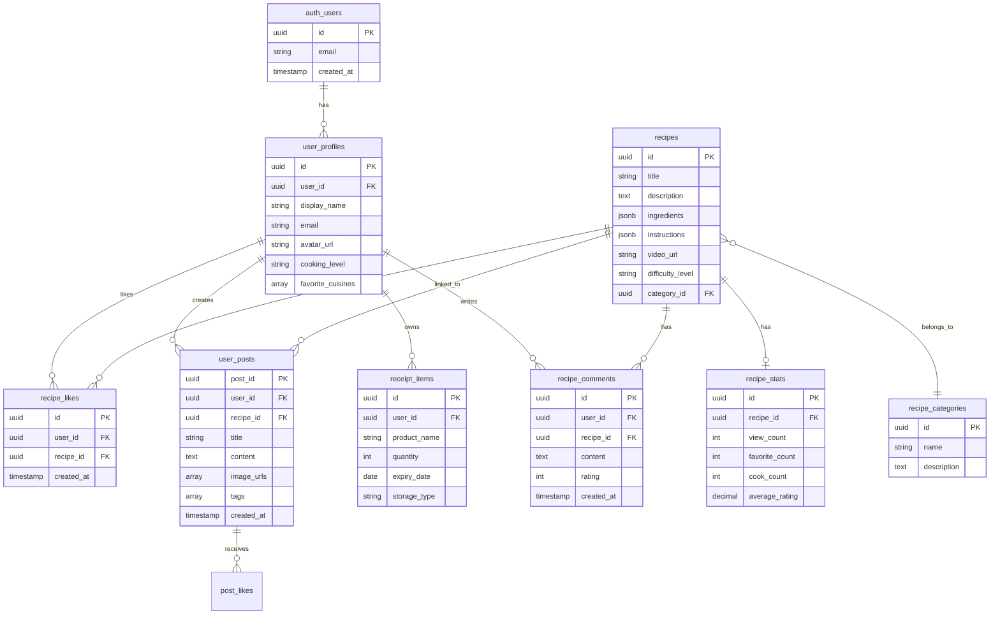
```mermaid
erDiagram
    auth_users ||--o{ user_profiles : "has"
    user_profiles ||--o{ recipe_likes : "likes"
    user_profiles ||--o{ user_posts : "creates"
    user_profiles ||--o{ receipt_items : "owns"
    user_profiles ||--o{ recipe_comments : "writes"
    
    recipes ||--o| recipe_stats : "has"
    recipes ||--o{ recipe_likes : "receives"
    recipes ||--o{ user_posts : "linked_to"
    recipes ||--o{ recipe_comments : "has"
    recipes }o--|| recipe_categories : "belongs_to"
    
    user_posts ||--o{ post_likes : "receives"
    
    auth_users {
        uuid id PK
        string email
        timestamp created_at
    }
    
    user_profiles {
        uuid id PK
        uuid user_id FK
        string display_name
        string email
        string avatar_url
        string cooking_level
        array favorite_cuisines
    }
    
    recipes {
        uuid id PK
        string title
        text description
        jsonb ingredients
        jsonb instructions
        string video_url
        string difficulty_level
        uuid category_id FK
    }
    
    recipe_stats {
        uuid id PK
        uuid recipe_id FK
        int view_count
        int favorite_count
        int cook_count
        decimal average_rating
    }
    
    recipe_likes {
        uuid id PK
        uuid user_id FK
        uuid recipe_id FK
        timestamp created_at
    }
    
    user_posts {
        uuid post_id PK
        uuid user_id FK
        uuid recipe_id FK
        string title
        text content
        array image_urls
        array tags
        timestamp created_at
    }
    
    receipt_items {
        uuid id PK
        uuid user_id FK
        string product_name
        int quantity
        date expiry_date
        string storage_type
    }
    
    recipe_comments {
        uuid id PK
        uuid user_id FK
        uuid recipe_id FK
        text content
        int rating
        timestamp created_at
    }
    
    recipe_categories {
        uuid id PK
        string name
        text description
    }
```

---

## 2. 시퀀스 다이어그램

### 2.1 사용자 로그인 시퀀스

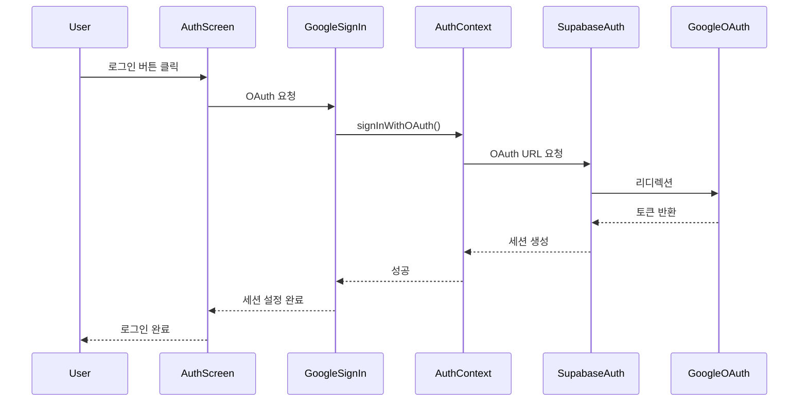
```mermaid
sequenceDiagram
    participant User
    participant AuthScreen
    participant GoogleSignIn
    participant AuthContext
    participant SupabaseAuth
    participant GoogleOAuth
    
    User->>AuthScreen: 로그인 버튼 클릭
    AuthScreen->>GoogleSignIn: OAuth 요청
    GoogleSignIn->>AuthContext: signInWithOAuth()
    AuthContext->>SupabaseAuth: OAuth URL 요청
    SupabaseAuth->>GoogleOAuth: 리디렉션
    GoogleOAuth-->>SupabaseAuth: 토큰 반환
    SupabaseAuth-->>AuthContext: 세션 생성
    AuthContext-->>GoogleSignIn: 성공
    GoogleSignIn-->>AuthScreen: 세션 설정 완료
    AuthScreen-->>User: 로그인 완료
```

### 2.2 레시피 조회 및 조회수 증가 시퀀스

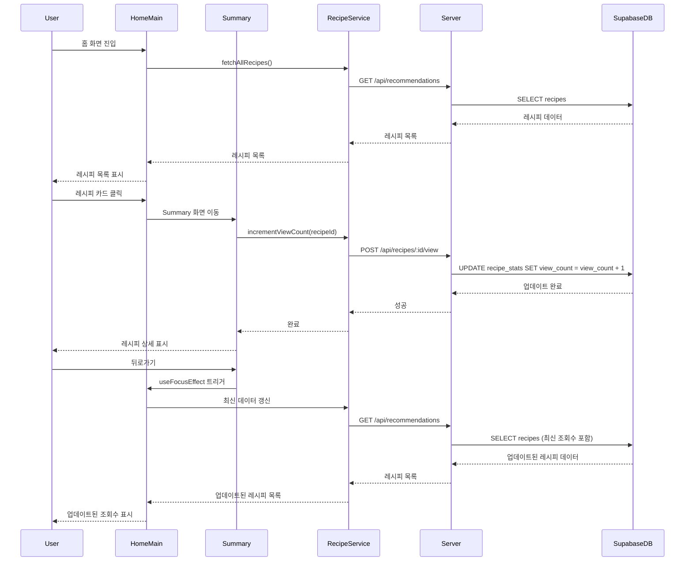
```mermaid
sequenceDiagram
    participant User
    participant HomeMain
    participant Summary
    participant RecipeService
    participant Server
    participant SupabaseDB
    
    User->>HomeMain: 홈 화면 진입
    HomeMain->>RecipeService: fetchAllRecipes()
    RecipeService->>Server: GET /api/recommendations
    Server->>SupabaseDB: SELECT recipes
    SupabaseDB-->>Server: 레시피 데이터
    Server-->>RecipeService: 레시피 목록
    RecipeService-->>HomeMain: 레시피 목록
    HomeMain-->>User: 레시피 목록 표시
    
    User->>HomeMain: 레시피 카드 클릭
    HomeMain->>Summary: Summary 화면 이동
    Summary->>RecipeService: incrementViewCount(recipeId)
    RecipeService->>Server: POST /api/recipes/:id/view
    Server->>SupabaseDB: UPDATE recipe_stats SET view_count = view_count + 1
    SupabaseDB-->>Server: 업데이트 완료
    Server-->>RecipeService: 성공
    RecipeService-->>Summary: 완료
    Summary-->>User: 레시피 상세 표시
    
    User->>Summary: 뒤로가기
    Summary->>HomeMain: useFocusEffect 트리거
    HomeMain->>RecipeService: 최신 데이터 갱신
    RecipeService->>Server: GET /api/recommendations
    Server->>SupabaseDB: SELECT recipes (최신 조회수 포함)
    SupabaseDB-->>Server: 업데이트된 레시피 데이터
    Server-->>RecipeService: 레시피 목록
    RecipeService-->>HomeMain: 업데이트된 레시피 목록
    HomeMain-->>User: 업데이트된 조회수 표시
```

### 2.3 YouTube 영상 분석 시퀀스

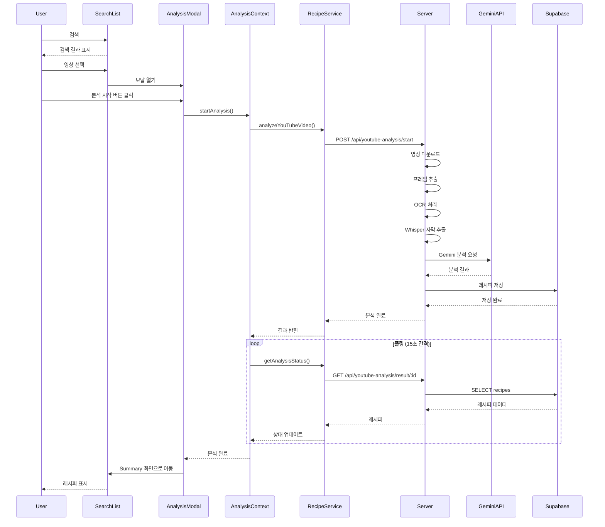
```mermaid
sequenceDiagram
    participant User
    participant SearchList
    participant AnalysisModal
    participant AnalysisContext
    participant RecipeService
    participant Server
    participant GeminiAPI
    participant Supabase
    
    User->>SearchList: 검색
    SearchList-->>User: 검색 결과 표시
    User->>SearchList: 영상 선택
    SearchList->>AnalysisModal: 모달 열기
    User->>AnalysisModal: 분석 시작 버튼 클릭
    AnalysisModal->>AnalysisContext: startAnalysis()
    AnalysisContext->>RecipeService: analyzeYouTubeVideo()
    RecipeService->>Server: POST /api/youtube-analysis/start
    Server->>Server: 영상 다운로드
    Server->>Server: 프레임 추출
    Server->>Server: OCR 처리
    Server->>Server: Whisper 자막 추출
    Server->>GeminiAPI: Gemini 분석 요청
    GeminiAPI-->>Server: 분석 결과
    Server->>Supabase: 레시피 저장
    Supabase-->>Server: 저장 완료
    Server-->>RecipeService: 분석 완료
    RecipeService-->>AnalysisContext: 결과 반환
    
    loop 폴링 (15초 간격)
        AnalysisContext->>RecipeService: getAnalysisStatus()
        RecipeService->>Server: GET /api/youtube-analysis/result/:id
        Server->>Supabase: SELECT recipes
        Supabase-->>Server: 레시피 데이터
        Server-->>RecipeService: 레시피
        RecipeService-->>AnalysisContext: 상태 업데이트
    end
    
    AnalysisContext-->>AnalysisModal: 분석 완료
    AnalysisModal->>SearchList: Summary 화면으로 이동
    SearchList-->>User: 레시피 표시
```

### 2.4 레시피 조리 가이드 시퀀스 (음성 제어 포함)

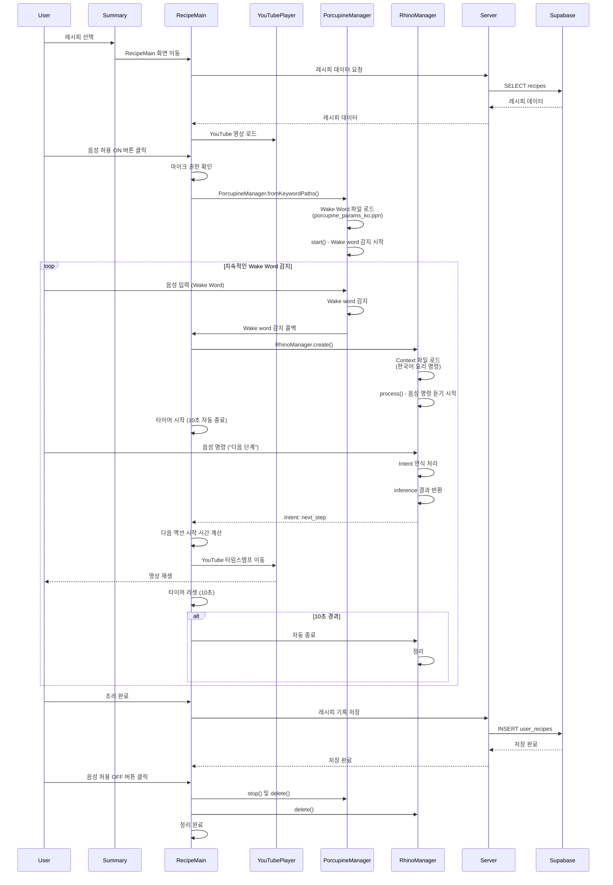
```mermaid
sequenceDiagram
    participant User
    participant Summary
    participant RecipeMain
    participant YouTubePlayer
    participant PorcupineManager
    participant RhinoManager
    participant Server
    participant Supabase
    
    User->>Summary: 레시피 선택
    Summary->>RecipeMain: RecipeMain 화면 이동
    RecipeMain->>Server: 레시피 데이터 요청
    Server->>Supabase: SELECT recipes
    Supabase-->>Server: 레시피 데이터
    Server-->>RecipeMain: 레시피 데이터
    RecipeMain->>YouTubePlayer: YouTube 영상 로드
    
    User->>RecipeMain: 음성 허용 ON 버튼 클릭
    RecipeMain->>RecipeMain: 마이크 권한 확인
    RecipeMain->>PorcupineManager: PorcupineManager.fromKeywordPaths()
    PorcupineManager->>PorcupineManager: Wake Word 파일 로드<br/>(porcupine_params_ko.ppn)
    PorcupineManager->>PorcupineManager: start() - Wake word 감지 시작
    
    loop 지속적인 Wake Word 감지
        User->>PorcupineManager: 음성 입력 (Wake Word)
        PorcupineManager->>PorcupineManager: Wake word 감지
        PorcupineManager->>RecipeMain: Wake word 감지 콜백
        RecipeMain->>RhinoManager: RhinoManager.create()
        RhinoManager->>RhinoManager: Context 파일 로드<br/>(한국어 요리 명령)
        RhinoManager->>RhinoManager: process() - 음성 명령 듣기 시작
        RecipeMain->>RecipeMain: 타이머 시작 (10초 자동 종료)
        
        User->>RhinoManager: 음성 명령 ("다음 단계")
        RhinoManager->>RhinoManager: Intent 인식 처리
        RhinoManager->>RhinoManager: inference 결과 반환
        RhinoManager-->>RecipeMain: Intent: next_step
        RecipeMain->>RecipeMain: 다음 액션 시작 시간 계산
        RecipeMain->>YouTubePlayer: YouTube 타임스탬프 이동
        YouTubePlayer-->>User: 영상 재생
        RecipeMain->>RecipeMain: 타이머 리셋 (10초)
        
        alt 10초 경과
            RecipeMain->>RhinoManager: 자동 종료
            RhinoManager->>RhinoManager: 정리
        end
    end
    
    User->>RecipeMain: 조리 완료
    RecipeMain->>Server: 레시피 기록 저장
    Server->>Supabase: INSERT user_recipes
    Supabase-->>Server: 저장 완료
    Server-->>RecipeMain: 저장 완료
    
    User->>RecipeMain: 음성 허용 OFF 버튼 클릭
    RecipeMain->>PorcupineManager: stop() 및 delete()
    RecipeMain->>RhinoManager: delete()
    RecipeMain->>RecipeMain: 정리 완료
```

### 2.7 음성 인식 상세 시퀀스

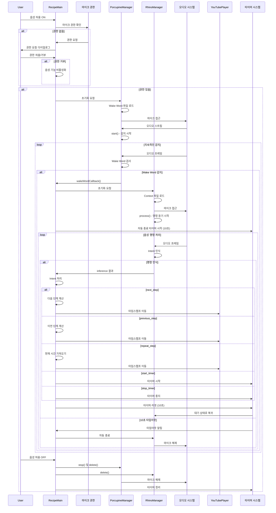
```mermaid
sequenceDiagram
    participant User
    participant RecipeMain
    participant Permission as 마이크 권한
    participant PorcupineManager
    participant RhinoManager
    participant Audio as 오디오 시스템
    participant YouTubePlayer
    participant Timer as 타이머 시스템
    
    User->>RecipeMain: 음성 허용 ON
    RecipeMain->>Permission: 마이크 권한 확인
    alt 권한 없음
        Permission->>RecipeMain: 권한 요청
        RecipeMain->>User: 권한 요청 다이얼로그
        User->>RecipeMain: 권한 허용/거부
        alt 권한 거부
            RecipeMain->>RecipeMain: 음성 기능 비활성화
        end
    end
    
    alt 권한 있음
        RecipeMain->>PorcupineManager: 초기화 요청
        PorcupineManager->>PorcupineManager: Wake Word 파일 로드
        PorcupineManager->>Audio: 마이크 접근
        Audio->>PorcupineManager: 오디오 스트림
        PorcupineManager->>PorcupineManager: start() - 감지 시작
        
        loop 지속적인 감지
            Audio->>PorcupineManager: 오디오 프레임
            PorcupineManager->>PorcupineManager: Wake Word 검사
            alt Wake Word 감지
                PorcupineManager->>RecipeMain: wakeWordCallback()
                RecipeMain->>RhinoManager: 초기화 요청
                RhinoManager->>RhinoManager: Context 파일 로드
                RhinoManager->>Audio: 마이크 접근
                RhinoManager->>RhinoManager: process() - 명령 듣기 시작
                RecipeMain->>Timer: 자동 종료 타이머 시작 (10초)
                
                loop 음성 명령 처리
                    Audio->>RhinoManager: 오디오 프레임
                    RhinoManager->>RhinoManager: Intent 인식
                    alt 명령 인식
                        RhinoManager->>RecipeMain: inference 결과
                        RecipeMain->>RecipeMain: Intent 처리
                        alt next_step
                            RecipeMain->>RecipeMain: 다음 단계 계산
                            RecipeMain->>YouTubePlayer: 타임스탬프 이동
                        else previous_step
                            RecipeMain->>RecipeMain: 이전 단계 계산
                            RecipeMain->>YouTubePlayer: 타임스탬프 이동
                        else repeat_step
                            RecipeMain->>RecipeMain: 현재 시간 가져오기
                            RecipeMain->>YouTubePlayer: 타임스탬프 이동
                        else start_timer
                            RecipeMain->>Timer: 타이머 시작
                        else stop_timer
                            RecipeMain->>Timer: 타이머 중지
                        end
                        RecipeMain->>Timer: 타이머 리셋 (10초)
                        Timer->>RhinoManager: 대기 상태로 복귀
                    else 10초 타임아웃
                        Timer->>RecipeMain: 타임아웃 알림
                        RecipeMain->>RhinoManager: 자동 종료
                        RhinoManager->>Audio: 마이크 해제
                    end
                end
            end
        end
        
        User->>RecipeMain: 음성 허용 OFF
        RecipeMain->>PorcupineManager: stop() 및 delete()
        RecipeMain->>RhinoManager: delete()
        PorcupineManager->>Audio: 마이크 해제
        RecipeMain->>Timer: 타이머 정리
    end
```

### 2.5 재료 관리 (영수증 OCR) 시퀀스

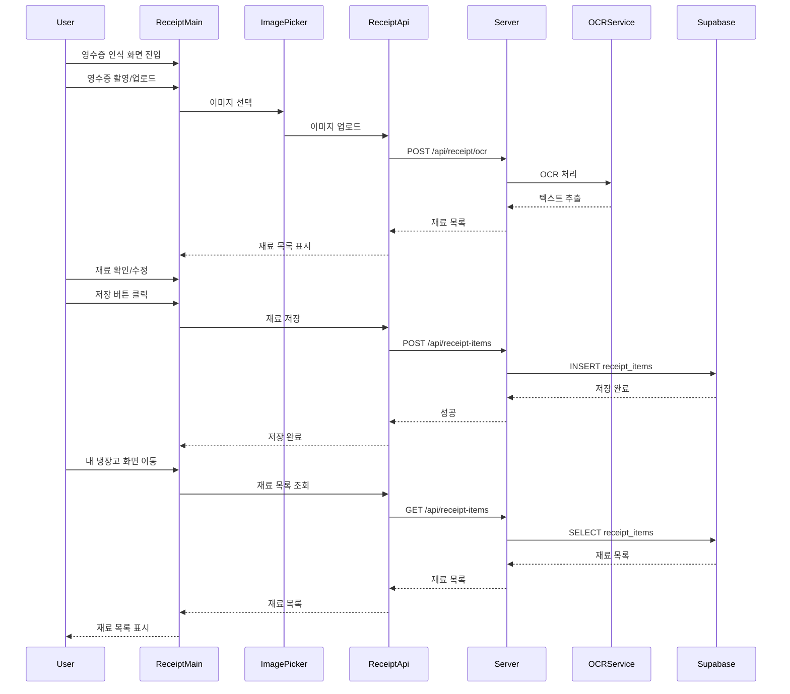
```mermaid
sequenceDiagram
    participant User
    participant ReceiptMain
    participant ImagePicker
    participant ReceiptApi
    participant Server
    participant OCRService
    participant Supabase
    
    User->>ReceiptMain: 영수증 인식 화면 진입
    User->>ReceiptMain: 영수증 촬영/업로드
    ReceiptMain->>ImagePicker: 이미지 선택
    ImagePicker->>ReceiptApi: 이미지 업로드
    ReceiptApi->>Server: POST /api/receipt/ocr
    Server->>OCRService: OCR 처리
    OCRService-->>Server: 텍스트 추출
    Server-->>ReceiptApi: 재료 목록
    ReceiptApi-->>ReceiptMain: 재료 목록 표시
    
    User->>ReceiptMain: 재료 확인/수정
    User->>ReceiptMain: 저장 버튼 클릭
    ReceiptMain->>ReceiptApi: 재료 저장
    ReceiptApi->>Server: POST /api/receipt-items
    Server->>Supabase: INSERT receipt_items
    Supabase-->>Server: 저장 완료
    Server-->>ReceiptApi: 성공
    ReceiptApi-->>ReceiptMain: 저장 완료
    
    User->>ReceiptMain: 내 냉장고 화면 이동
    ReceiptMain->>ReceiptApi: 재료 목록 조회
    ReceiptApi->>Server: GET /api/receipt-items
    Server->>Supabase: SELECT receipt_items
    Supabase-->>Server: 재료 목록
    Server-->>ReceiptApi: 재료 목록
    ReceiptApi-->>ReceiptMain: 재료 목록
    ReceiptMain-->>User: 재료 목록 표시
```

### 2.6 커뮤니티 게시글 작성 시퀀스

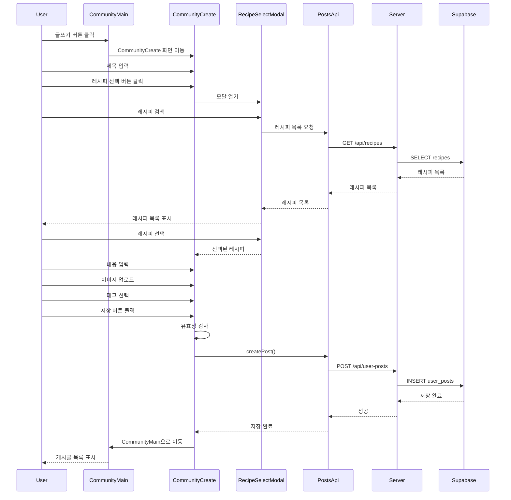
```mermaid
sequenceDiagram
    participant User
    participant CommunityMain
    participant CommunityCreate
    participant RecipeSelectModal
    participant PostsApi
    participant Server
    participant Supabase
    
    User->>CommunityMain: 글쓰기 버튼 클릭
    CommunityMain->>CommunityCreate: CommunityCreate 화면 이동
    User->>CommunityCreate: 제목 입력
    User->>CommunityCreate: 레시피 선택 버튼 클릭
    CommunityCreate->>RecipeSelectModal: 모달 열기
    User->>RecipeSelectModal: 레시피 검색
    RecipeSelectModal->>PostsApi: 레시피 목록 요청
    PostsApi->>Server: GET /api/recipes
    Server->>Supabase: SELECT recipes
    Supabase-->>Server: 레시피 목록
    Server-->>PostsApi: 레시피 목록
    PostsApi-->>RecipeSelectModal: 레시피 목록
    RecipeSelectModal-->>User: 레시피 목록 표시
    
    User->>RecipeSelectModal: 레시피 선택
    RecipeSelectModal-->>CommunityCreate: 선택된 레시피
    User->>CommunityCreate: 내용 입력
    User->>CommunityCreate: 이미지 업로드
    User->>CommunityCreate: 태그 선택
    User->>CommunityCreate: 저장 버튼 클릭
    CommunityCreate->>CommunityCreate: 유효성 검사
    CommunityCreate->>PostsApi: createPost()
    PostsApi->>Server: POST /api/user-posts
    Server->>Supabase: INSERT user_posts
    Supabase-->>Server: 저장 완료
    Server-->>PostsApi: 성공
    PostsApi-->>CommunityCreate: 저장 완료
    CommunityCreate->>CommunityMain: CommunityMain으로 이동
    CommunityMain-->>User: 게시글 목록 표시
```

---

## 3. 상태 다이어그램

### 3.1 인증 상태 전이

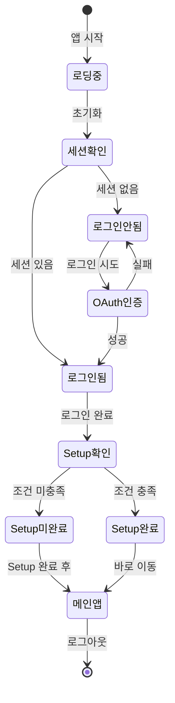
```mermaid
stateDiagram-v2
    [*] --> 로딩중: 앱 시작
    로딩중 --> 세션확인: 초기화
    세션확인 --> 로그인안됨: 세션 없음
    세션확인 --> 로그인됨: 세션 있음
    로그인안됨 --> OAuth인증: 로그인 시도
    OAuth인증 --> 로그인됨: 성공
    OAuth인증 --> 로그인안됨: 실패
    로그인됨 --> Setup확인: 로그인 완료
    Setup확인 --> Setup미완료: 조건 미충족
    Setup확인 --> Setup완료: 조건 충족
    Setup미완료 --> 메인앱: Setup 완료 후
    Setup완료 --> 메인앱: 바로 이동
    메인앱 --> [*]: 로그아웃
```

### 3.2 레시피 분석 상태 전이

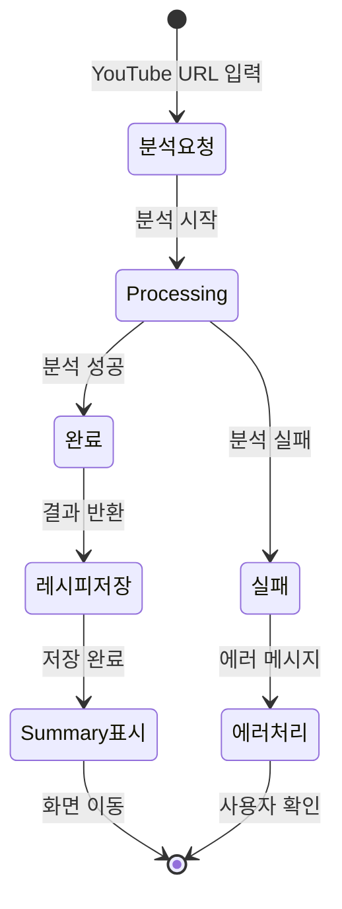
```mermaid
stateDiagram-v2
    [*] --> 분석요청: YouTube URL 입력
    분석요청 --> Processing: 분석 시작
    Processing --> 완료: 분석 성공
    Processing --> 실패: 분석 실패
    완료 --> 레시피저장: 결과 반환
    레시피저장 --> Summary표시: 저장 완료
    실패 --> 에러처리: 에러 메시지
    Summary표시 --> [*]: 화면 이동
    에러처리 --> [*]: 사용자 확인
```

### 3.3 음성 인식 상태 전이

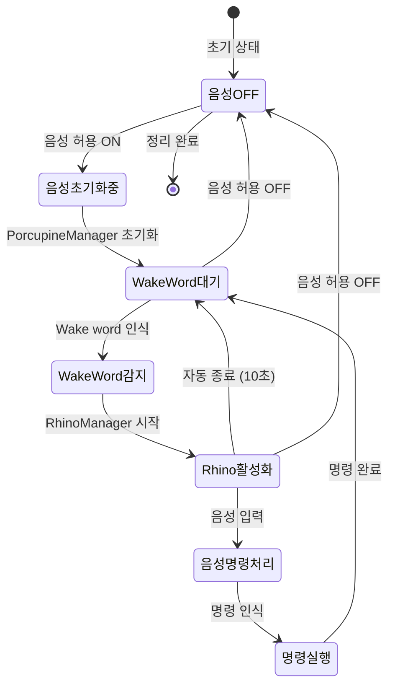
```mermaid
stateDiagram-v2
    [*] --> 음성OFF: 초기 상태
    음성OFF --> 음성초기화중: 음성 허용 ON
    음성초기화중 --> WakeWord대기: PorcupineManager 초기화
    WakeWord대기 --> WakeWord감지: Wake word 인식
    WakeWord감지 --> Rhino활성화: RhinoManager 시작
    Rhino활성화 --> 음성명령처리: 음성 입력
    음성명령처리 --> 명령실행: 명령 인식
    명령실행 --> WakeWord대기: 명령 완료
    Rhino활성화 --> WakeWord대기: 자동 종료 (10초)
    WakeWord대기 --> 음성OFF: 음성 허용 OFF
    Rhino활성화 --> 음성OFF: 음성 허용 OFF
    음성OFF --> [*]: 정리 완료
```

---

## 4. 플로우차트

### 4.1 레시피 추천 시스템 플로우

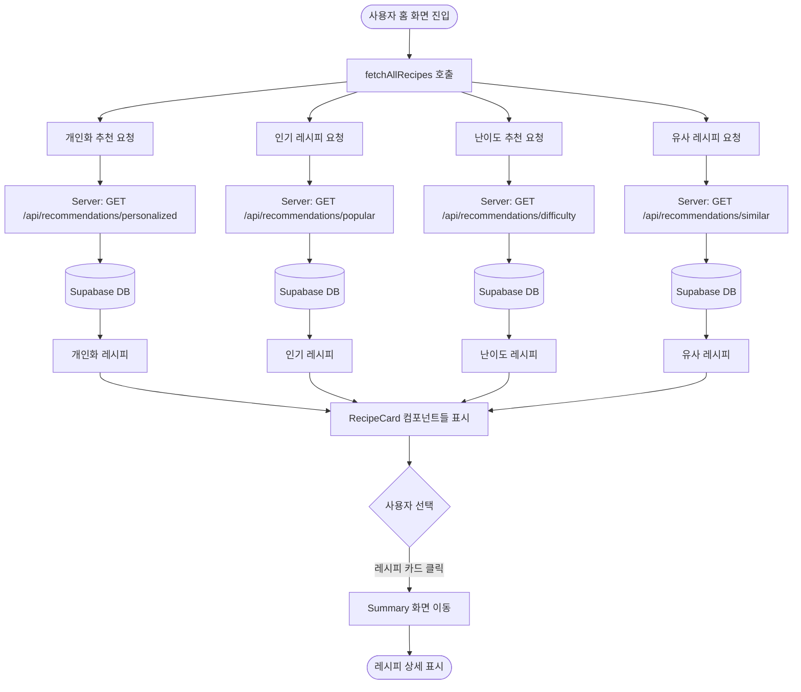
```mermaid
flowchart TD
    Start([사용자 홈 화면 진입]) --> FetchRecipes[fetchAllRecipes 호출]
    FetchRecipes --> PersonalRec[개인화 추천 요청]
    FetchRecipes --> PopularRec[인기 레시피 요청]
    FetchRecipes --> DifficultyRec[난이도 추천 요청]
    FetchRecipes --> SimilarRec[유사 레시피 요청]
    
    PersonalRec --> Server1[Server: GET /api/recommendations/personalized]
    PopularRec --> Server2[Server: GET /api/recommendations/popular]
    DifficultyRec --> Server3[Server: GET /api/recommendations/difficulty]
    SimilarRec --> Server4[Server: GET /api/recommendations/similar]
    
    Server1 --> DB1[(Supabase DB)]
    Server2 --> DB2[(Supabase DB)]
    Server3 --> DB3[(Supabase DB)]
    Server4 --> DB4[(Supabase DB)]
    
    DB1 --> Result1[개인화 레시피]
    DB2 --> Result2[인기 레시피]
    DB3 --> Result3[난이도 레시피]
    DB4 --> Result4[유사 레시피]
    
    Result1 --> Display[RecipeCard 컴포넌트들 표시]
    Result2 --> Display
    Result3 --> Display
    Result4 --> Display
    
    Display --> UserSelect{사용자 선택}
    UserSelect -->|레시피 카드 클릭| Summary[Summary 화면 이동]
    Summary --> End([레시피 상세 표시])
```

### 4.2 조회수 증가 플로우

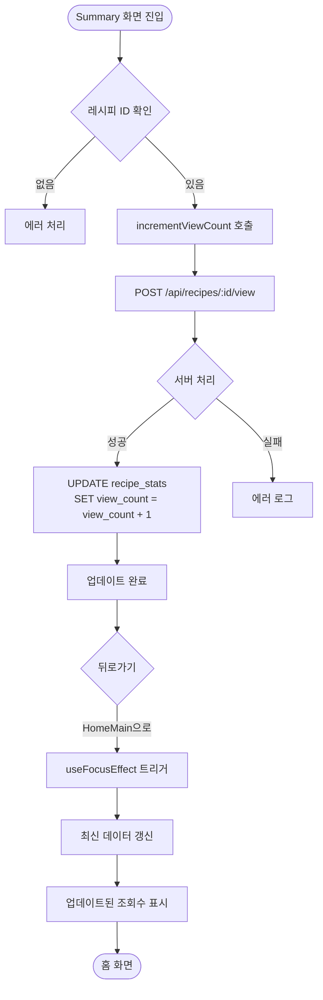
```mermaid
flowchart TD
    Start([Summary 화면 진입]) --> CheckRecipe{레시피 ID 확인}
    CheckRecipe -->|없음| Error1[에러 처리]
    CheckRecipe -->|있음| IncrementView[incrementViewCount 호출]
    
    IncrementView --> API[POST /api/recipes/:id/view]
    API --> Server{서버 처리}
    Server -->|성공| UpdateDB[UPDATE recipe_stats<br/>SET view_count = view_count + 1]
    Server -->|실패| Error2[에러 로그]
    
    UpdateDB --> Success[업데이트 완료]
    Success --> BackToHome{뒤로가기}
    BackToHome -->|HomeMain으로| FocusEffect[useFocusEffect 트리거]
    FocusEffect --> Refresh[최신 데이터 갱신]
    Refresh --> Display[업데이트된 조회수 표시]
    Display --> End([홈 화면])
```

### 4.3 YouTube 영상 분석 플로우

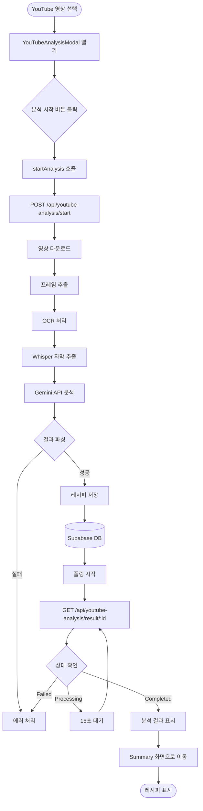
```mermaid
flowchart TD
    Start([YouTube 영상 선택]) --> OpenModal[YouTubeAnalysisModal 열기]
    OpenModal --> ClickAnalyze{분석 시작 버튼 클릭}
    ClickAnalyze --> StartAnalysis[startAnalysis 호출]
    StartAnalysis --> APIRequest[POST /api/youtube-analysis/start]
    
    APIRequest --> Download[영상 다운로드]
    Download --> ExtractFrame[프레임 추출]
    ExtractFrame --> OCR[OCR 처리]
    OCR --> Whisper[Whisper 자막 추출]
    Whisper --> Gemini[Gemini API 분석]
    
    Gemini --> ParseResult{결과 파싱}
    ParseResult -->|성공| SaveRecipe[레시피 저장]
    ParseResult -->|실패| Error[에러 처리]
    
    SaveRecipe --> SaveDB[(Supabase DB)]
    SaveDB --> StartPolling[폴링 시작]
    
    StartPolling --> PollStatus[GET /api/youtube-analysis/result/:id]
    PollStatus --> CheckStatus{상태 확인}
    CheckStatus -->|Processing| Wait[15초 대기]
    Wait --> PollStatus
    CheckStatus -->|Completed| ShowResult[분석 결과 표시]
    CheckStatus -->|Failed| Error
    
    ShowResult --> Navigate[Summary 화면으로 이동]
    Navigate --> End([레시피 표시])
```

### 4.4 음성 인식 시스템 플로우

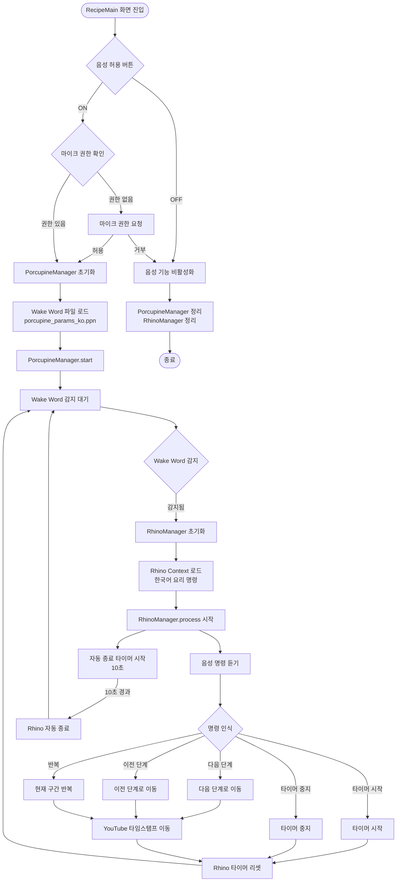
```mermaid
flowchart TD
    Start([RecipeMain 화면 진입]) --> VoiceToggle{음성 허용 버튼}
    VoiceToggle -->|OFF| VoiceOff[음성 기능 비활성화]
    VoiceToggle -->|ON| CheckPermission{마이크 권한 확인}
    
    CheckPermission -->|권한 없음| RequestPermission[마이크 권한 요청]
    RequestPermission -->|거부| VoiceOff
    RequestPermission -->|허용| InitPorcupine[PorcupineManager 초기화]
    CheckPermission -->|권한 있음| InitPorcupine
    
    InitPorcupine --> LoadWakeWord[Wake Word 파일 로드<br/>porcupine_params_ko.ppn]
    LoadWakeWord --> StartPorcupine[PorcupineManager.start]
    StartPorcupine --> WakeWordListening[Wake Word 감지 대기]
    
    WakeWordListening --> WakeWordDetected{Wake Word 감지}
    WakeWordDetected -->|감지됨| InitRhino[RhinoManager 초기화]
    
    InitRhino --> LoadContext[Rhino Context 로드<br/>한국어 요리 명령]
    LoadContext --> StartRhino[RhinoManager.process 시작]
    StartRhino --> VoiceListening[음성 명령 듣기]
    StartRhino --> StartTimer[자동 종료 타이머 시작<br/>10초]
    
    VoiceListening --> CommandDetected{명령 인식}
    CommandDetected -->|다음 단계| NextStep[다음 단계로 이동]
    CommandDetected -->|이전 단계| PrevStep[이전 단계로 이동]
    CommandDetected -->|반복| Repeat[현재 구간 반복]
    CommandDetected -->|타이머 시작| StartTimerAction[타이머 시작]
    CommandDetected -->|타이머 중지| StopTimerAction[타이머 중지]
    
    NextStep --> UpdateVideo[YouTube 타임스탬프 이동]
    PrevStep --> UpdateVideo
    Repeat --> UpdateVideo
    StartTimerAction --> ResetRhinoTimer[Rhino 타이머 리셋]
    StopTimerAction --> ResetRhinoTimer
    
    UpdateVideo --> ResetRhinoTimer
    ResetRhinoTimer --> WakeWordListening
    
    StartTimer -->|10초 경과| AutoStopRhino[Rhino 자동 종료]
    AutoStopRhino --> WakeWordListening
    
    VoiceOff --> Cleanup[PorcupineManager 정리<br/>RhinoManager 정리]
    Cleanup --> End([종료])
```

### 4.5 음성 명령 처리 플로우

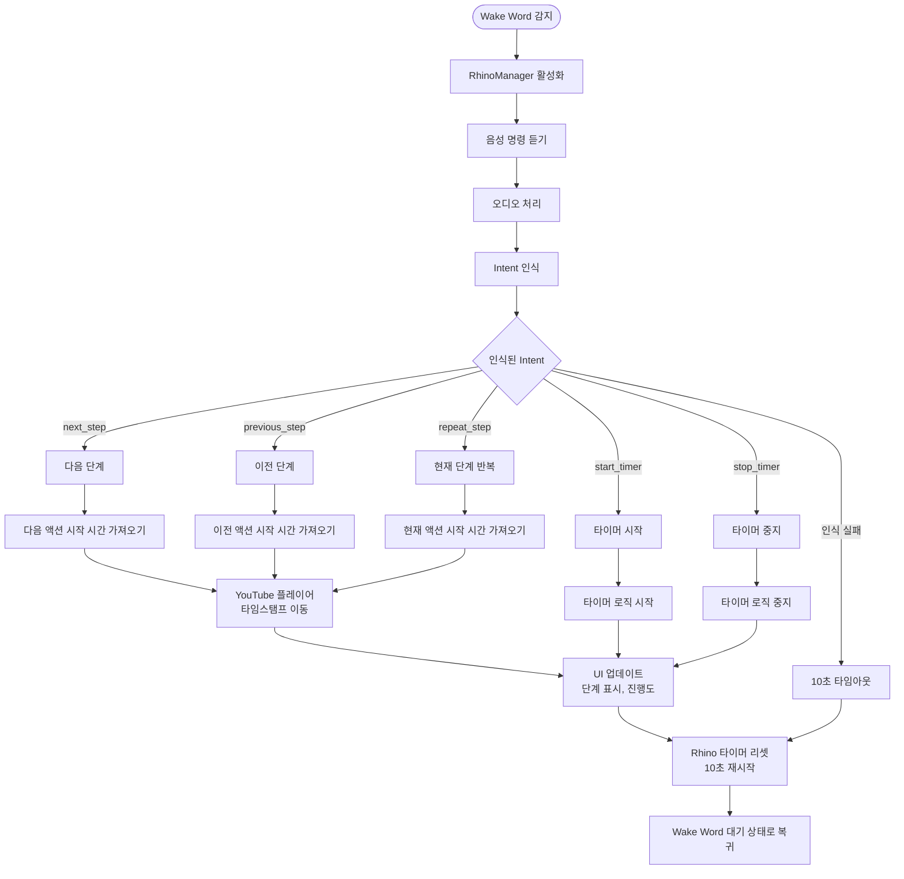
```mermaid
flowchart TD
    Start([Wake Word 감지]) --> ActivateRhino[RhinoManager 활성화]
    ActivateRhino --> ListenCommand[음성 명령 듣기]
    ListenCommand --> ProcessAudio[오디오 처리]
    ProcessAudio --> IntentRecognition[Intent 인식]
    
    IntentRecognition --> CheckIntent{인식된 Intent}
    CheckIntent -->|next_step| NextStep[다음 단계]
    CheckIntent -->|previous_step| PreviousStep[이전 단계]
    CheckIntent -->|repeat_step| RepeatStep[현재 단계 반복]
    CheckIntent -->|start_timer| StartTimer[타이머 시작]
    CheckIntent -->|stop_timer| StopTimer[타이머 중지]
    CheckIntent -->|인식 실패| Timeout[10초 타임아웃]
    
    NextStep --> GetNextTime[다음 액션 시작 시간 가져오기]
    PreviousStep --> GetPrevTime[이전 액션 시작 시간 가져오기]
    RepeatStep --> GetCurrentTime[현재 액션 시작 시간 가져오기]
    
    GetNextTime --> MoveVideo[YouTube 플레이어<br/>타임스탬프 이동]
    GetPrevTime --> MoveVideo
    GetCurrentTime --> MoveVideo
    
    StartTimer --> StartTimerLogic[타이머 로직 시작]
    StopTimer --> StopTimerLogic[타이머 로직 중지]
    
    MoveVideo --> UpdateUI[UI 업데이트<br/>단계 표시, 진행도]
    StartTimerLogic --> UpdateUI
    StopTimerLogic --> UpdateUI
    
    UpdateUI --> ResetRhinoTimer[Rhino 타이머 리셋<br/>10초 재시작]
    Timeout --> ResetRhinoTimer
    ResetRhinoTimer --> WakeWordWait[Wake Word 대기 상태로 복귀]
```

---

## 5. 컴포넌트 상호작용 다이어그램

### 5.1 레시피 추천 시스템 상호작용

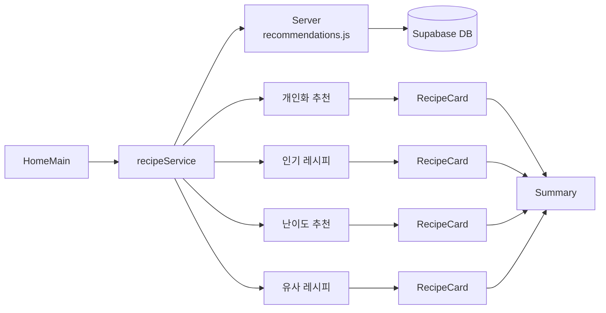
```mermaid
graph LR
    HomeMain[HomeMain] --> RecipeService[recipeService]
    RecipeService --> Server1[Server<br/>recommendations.js]
    Server1 --> Supabase[(Supabase DB)]
    
    RecipeService --> Personal[개인화 추천]
    RecipeService --> Popular[인기 레시피]
    RecipeService --> Difficulty[난이도 추천]
    RecipeService --> Similar[유사 레시피]
    
    Personal --> RecipeCard1[RecipeCard]
    Popular --> RecipeCard2[RecipeCard]
    Difficulty --> RecipeCard3[RecipeCard]
    Similar --> RecipeCard4[RecipeCard]
    
    RecipeCard1 --> Summary[Summary]
    RecipeCard2 --> Summary
    RecipeCard3 --> Summary
    RecipeCard4 --> Summary
```

### 5.2 음성 제어 시스템 상호작용

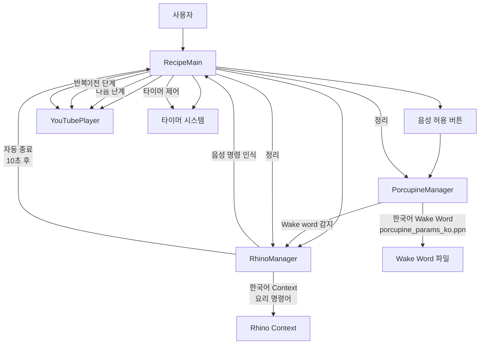
```mermaid
graph TB
    User[사용자] --> RecipeMain[RecipeMain]
    RecipeMain --> VoiceToggle[음성 허용 버튼]
    VoiceToggle --> Porcupine[PorcupineManager]
    RecipeMain --> Rhino[RhinoManager]
    RecipeMain --> YouTube[YouTubePlayer]
    RecipeMain --> Timer[타이머 시스템]
    
    Porcupine -->|Wake word 감지| Rhino
    Porcupine -->|한국어 Wake Word<br/>porcupine_params_ko.ppn| WakeWord[Wake Word 파일]
    
    Rhino -->|음성 명령 인식| RecipeMain
    Rhino -->|한국어 Context<br/>요리 명령어| Context[Rhino Context]
    
    RecipeMain -->|다음 단계| YouTube
    RecipeMain -->|이전 단계| YouTube
    RecipeMain -->|반복| YouTube
    RecipeMain -->|타이머 제어| Timer
    
    Rhino -->|자동 종료<br/>10초 후| RecipeMain
    RecipeMain -->|정리| Porcupine
    RecipeMain -->|정리| Rhino
```

### 5.3 음성 인식 시스템 아키텍처

```mermaid
graph LR
    subgraph Mobile["모바일 앱"]
        RecipeMain[RecipeMain 화면]
        VoiceButton[음성 허용 버튼]
    end
    
    subgraph Picovoice["Picovoice SDK"]
        Porcupine[PorcupineManager<br/>Wake Word Detection]
        Rhino[RhinoManager<br/>Intent Recognition]
    end
    
    subgraph Files["로컬 파일"]
        WakeWordFile[porcupine_params_ko.ppn<br/>한국어 Wake Word]
        RhinoContext[rhino_params_ko.rhn<br/>한국어 Context]
        ModelFile[porcupine_params_ko.pv<br/>한국어 모델]
    end
    
    subgraph Audio["오디오 시스템"]
        Microphone[마이크 입력]
        AudioProcessor[오디오 처리]
    end
    
    subgraph Actions["액션 처리"]
        VideoControl[YouTube 플레이어 제어]
        StepControl[단계 이동]
        TimerControl[타이머 제어]
    end
    
    RecipeMain --> VoiceButton
    VoiceButton --> Porcupine
    Porcupine --> WakeWordFile
    Porcupine --> ModelFile
    Porcupine --> Microphone
    Microphone --> AudioProcessor
    AudioProcessor --> Porcupine
    Porcupine -->|Wake word 감지| Rhino
    Rhino --> RhinoContext
    Rhino --> AudioProcessor
    AudioProcessor --> Rhino
    Rhino -->|Intent 인식| Actions
    Actions --> VideoControl
    Actions --> StepControl
    Actions --> TimerControl
    VideoControl --> RecipeMain
    StepControl --> RecipeMain
    TimerControl --> RecipeMain
```

---

## 6. 데이터 흐름 다이어그램

### 6.1 조회수 증가 데이터 흐름

```mermaid
flowchart LR
    Summary[Summary 화면] -->|incrementViewCount<br/>recipeId| RecipeService[recipeService]
    RecipeService -->|POST<br/>/api/recipes/:id/view| Server[Server<br/>recipes.js]
    Server -->|UPDATE recipe_stats<br/>SET view_count = view_count + 1| Supabase[(Supabase DB)]
    Supabase -->|업데이트 완료| Server
    Server -->|성공 응답| RecipeService
    RecipeService -->|완료| Summary
    Summary -->|뒤로가기| HomeMain[HomeMain]
    HomeMain -->|useFocusEffect| Refresh[데이터 갱신]
    Refresh -->|GET /api/recommendations| RecipeService
    RecipeService -->|최신 조회수 포함| HomeMain
```

---

## 5. 홈 화면 추천 시스템 다이어그램

### 5.1 홈 화면 추천 시스템 전체 플로우

```mermaid
flowchart TD
    Start([홈 화면 진입]) --> CheckAuth{인증 상태 확인}
    
    CheckAuth -->|로그인| FetchAll[fetchAllRecipes 호출]
    CheckAuth -->|비로그인| FetchPublic[공개 레시피만 조회]
    
    FetchAll --> ParallelFetch[4가지 추천 API 병렬 호출]
    
    subgraph ParallelFetch["병렬 API 호출"]
        P1[1. 개인화 추천<br/>getRecommendedRecipes]
        P2[2. 난이도 기반<br/>getRecipesByDifficulty]
        P3[3. 인기 레시피<br/>getPopularRecipes]
        P4[4. 유사 레시피<br/>getSimilarToCookedRecipes]
    end
    
    ParallelFetch --> WaitAll[모든 응답 대기]
    WaitAll --> Transform[데이터 변환 및 통합]
    Transform --> Display[화면에 표시]
    
    Display --> Refresh{새로고침?}
    Refresh -->|Pull-to-Refresh| FetchAll
    Refresh -->|화면 포커스| FetchAll
    Refresh -->|정상 종료| End([종료])
    
    FetchPublic --> Display
```

### 5.2 개인화 추천 시스템 시퀀스

```mermaid
sequenceDiagram
    participant User
    participant HomeMain
    participant RecipeService
    participant Backend
    participant Supabase
    
    User->>HomeMain: 홈 화면 진입
    HomeMain->>RecipeService: getRecommendedRecipes()
    RecipeService->>RecipeService: 인증 토큰 확인
    
    alt 토큰 있음
        RecipeService->>Backend: GET /api/recommendations/user<br/>(Authorization: Bearer token)
        Backend->>Backend: 토큰 검증
        Backend->>Supabase: SELECT user_profiles<br/>(favorite_cuisines, dietary_restrictions)
        
        alt 선호 요리 정보 있음
            Supabase-->>Backend: user_profiles 데이터
            Backend->>Supabase: SELECT recipe_categories<br/>(favorite_cuisines 매핑)
            Supabase-->>Backend: category_ids
            Backend->>Supabase: SELECT recipes<br/>(category_id IN, JOIN stats/categories/likes)
            Supabase-->>Backend: 레시피 목록
            Backend->>Backend: dietary_restrictions 필터링
            Backend->>Backend: 좋아요 상태 추가
            Backend-->>RecipeService: 추천 레시피 목록
        else 선호 요리 정보 없음
            Backend->>Supabase: SELECT recipes<br/>(ORDER BY created_at DESC LIMIT 10)
            Supabase-->>Backend: 최신 레시피 목록
            Backend-->>RecipeService: 최신 레시피 목록
        end
    else 토큰 없음
        RecipeService->>Backend: GET /api/recipes<br/>(공개 레시피)
        Backend->>Supabase: SELECT recipes<br/>(공개 레시피)
        Supabase-->>Backend: 공개 레시피 목록
        Backend-->>RecipeService: 공개 레시피 목록
    end
    
    RecipeService-->>HomeMain: 추천 레시피 목록
    HomeMain->>HomeMain: 데이터 변환 및 상태 업데이트
    HomeMain-->>User: 화면에 표시
```

### 5.3 난이도 기반 추천 시스템 시퀀스

```mermaid
sequenceDiagram
    participant User
    participant HomeMain
    participant RecipeService
    participant Backend
    participant Supabase
    
    User->>HomeMain: 홈 화면 진입
    HomeMain->>RecipeService: getRecipesByDifficulty(limit: 6)
    RecipeService->>RecipeService: 인증 토큰 확인
    
    alt 토큰 있음
        RecipeService->>Backend: GET /api/recommendations/by-difficulty?limit=6<br/>(Authorization: Bearer token)
        Backend->>Backend: 토큰 검증
        Backend->>Supabase: SELECT user_profiles<br/>(cooking_level)
        Supabase-->>Backend: cooking_level (beginner/intermediate/advanced)
        
        Backend->>Backend: 난이도 매핑<br/>(beginner→easy, intermediate→medium, advanced→hard)
        
        Backend->>Supabase: SELECT recipes<br/>(WHERE difficulty_level = target,<br/>JOIN stats/categories/likes)
        Supabase-->>Backend: 난이도별 레시피 목록
        Backend->>Backend: 좋아요 상태 추가
        Backend-->>RecipeService: 난이도별 레시피 목록
    else 토큰 없음
        RecipeService->>Backend: GET /api/recipes<br/>(공개 레시피)
        Backend->>Supabase: SELECT recipes<br/>(공개 레시피)
        Supabase-->>Backend: 공개 레시피 목록
        Backend-->>RecipeService: 공개 레시피 목록
    end
    
    RecipeService-->>HomeMain: 난이도별 레시피 목록
    HomeMain->>HomeMain: 데이터 변환 및 상태 업데이트
    HomeMain-->>User: 화면에 표시
```

### 5.4 인기 레시피 추천 시스템 시퀀스

```mermaid
sequenceDiagram
    participant User
    participant HomeMain
    participant RecipeService
    participant Backend
    participant Supabase
    
    User->>HomeMain: 홈 화면 진입
    HomeMain->>RecipeService: getPopularRecipes(limit: 3)
    RecipeService->>RecipeService: 인증 토큰 확인 (선택적)
    
    RecipeService->>Backend: GET /api/recommendations/popular?limit=3<br/>(Authorization: Bearer token, 선택적)
    
    alt 토큰 있음
        Backend->>Backend: 토큰 검증 (선택적)
    end
    
    Backend->>Supabase: SELECT recipes<br/>(JOIN recipe_stats, recipe_categories,<br/>recipe_likes, ORDER BY created_at)
    Supabase-->>Backend: 레시피 목록 (조회수 포함)
    
    Backend->>Backend: view_count 기준 정렬<br/>(내림차순)
    
    alt 토큰 있음
        Backend->>Backend: 좋아요 상태 추가
    end
    
    Backend->>Backend: 상위 3개만 선택
    Backend-->>RecipeService: 인기 레시피 목록 (상위 3개)
    
    RecipeService-->>HomeMain: 인기 레시피 목록
    HomeMain->>HomeMain: 데이터 변환 및 상태 업데이트
    HomeMain-->>User: 순위 형태로 화면에 표시<br/>(1위, 2위, 3위)
```

### 5.5 유사 레시피 추천 시스템 시퀀스

```mermaid
sequenceDiagram
    participant User
    participant HomeMain
    participant RecipeService
    participant Backend
    participant Supabase
    
    User->>HomeMain: 홈 화면 진입
    HomeMain->>RecipeService: getSimilarToCookedRecipes(limit: 6)
    RecipeService->>RecipeService: 인증 토큰 확인
    
    alt 토큰 있음
        RecipeService->>Backend: GET /api/recommendations/similar-to-cooked?limit=6<br/>(Authorization: Bearer token)
        Backend->>Backend: 토큰 검증
        Backend->>Supabase: SELECT user_posts<br/>(WHERE user_id = userId, recipe_id NOT NULL)
        Supabase-->>Backend: 완성한 레시피 목록
        
        alt 완성한 요리 있음
            Backend->>Backend: recipe_id 추출 및 중복 제거
            Backend->>Supabase: SELECT recipes<br/>(WHERE id IN cookedRecipeIds, category_id)
            Supabase-->>Backend: 완성한 레시피의 카테고리 정보
            
            Backend->>Backend: 카테고리별 빈도 계산<br/>(가장 많이 만든 카테고리 우선)
            
            Backend->>Supabase: SELECT recipes<br/>(WHERE category_id IN topCategories,<br/>id NOT IN cookedRecipeIds,<br/>JOIN stats/categories/likes)
            Supabase-->>Backend: 유사 카테고리 레시피 목록
            
            Backend->>Backend: 좋아요 상태 추가
            Backend-->>RecipeService: 유사 레시피 목록
        else 완성한 요리 없음
            Backend->>Supabase: SELECT recipes<br/>(ORDER BY created_at DESC LIMIT 6)
            Supabase-->>Backend: 최신 레시피 목록
            Backend->>Backend: 좋아요 상태 추가
            Backend-->>RecipeService: 최신 레시피 목록
        end
    else 토큰 없음
        RecipeService->>Backend: GET /api/recipes<br/>(공개 레시피)
        Backend->>Supabase: SELECT recipes<br/>(공개 레시피)
        Supabase-->>Backend: 공개 레시피 목록
        Backend-->>RecipeService: 공개 레시피 목록
    end
    
    RecipeService-->>HomeMain: 유사 레시피 목록
    HomeMain->>HomeMain: 데이터 변환 및 상태 업데이트
    HomeMain-->>User: 화면에 표시
```

### 5.6 추천 시스템 알고리즘 플로우

```mermaid
flowchart TD
    Start([추천 시스템 시작]) --> LoadUserProfile[사용자 프로필 로드]
    
    LoadUserProfile --> CheckProfile{프로필 정보 확인}
    
    CheckProfile -->|정보 있음| Personalized[개인화 추천]
    CheckProfile -->|정보 없음| Fallback[기본 추천]
    
    Personalized --> CuisineFilter[선호 요리 카테고리 필터]
    CuisineFilter --> DietaryFilter[알레르기/제외 재료 필터]
    DietaryFilter --> PersonalizedResult[개인화 추천 결과]
    
    Personalized --> DifficultyMap[난이도 매핑<br/>beginner→easy<br/>intermediate→medium<br/>advanced→hard]
    DifficultyMap --> DifficultyFilter[난이도 필터]
    DifficultyFilter --> DifficultyResult[난이도 기반 추천 결과]
    
    Personalized --> PopularSort[조회수 기준 정렬<br/>recipe_stats.view_count]
    PopularSort --> PopularResult[인기 레시피 결과]
    
    Personalized --> CookedHistory[완성한 요리 이력 조회]
    CookedHistory --> CategoryAnalysis[카테고리 빈도 분석]
    CategoryAnalysis --> SimilarCategory[유사 카테고리 필터]
    SimilarCategory --> ExcludeCooked[이미 만든 레시피 제외]
    ExcludeCooked --> SimilarResult[유사 레시피 결과]
    
    Fallback --> RecentRecipes[최신 레시피 조회]
    RecentRecipes --> FallbackResult[기본 추천 결과]
    
    PersonalizedResult --> Merge[Merge Results]
    DifficultyResult --> Merge
    PopularResult --> Merge
    SimilarResult --> Merge
    FallbackResult --> Merge
    
    Merge --> AddMetadata[메타데이터 추가<br/>조회수, 좋아요, 카테고리]
    AddMetadata --> AddLikeStatus[좋아요 상태 추가]
    AddLikeStatus --> Transform[데이터 변환]
    Transform --> Display[화면 표시]
```

### 5.7 추천 시스템 데이터 구조

```mermaid
classDiagram
    class HomeMain {
        +personalizedRecipes[]
        +difficultyRecipes[]
        +popularRecipes[]
        +similarRecipes[]
        +fetchAllRecipes()
        +handleFavoriteToggle()
        +handleRecipePress()
    }
    
    class RecipeService {
        +getRecommendedRecipes()
        +getRecipesByDifficulty()
        +getPopularRecipes()
        +getSimilarToCookedRecipes()
        +getAuthToken()
    }
    
    class RecommendationsAPI {
        +GET /api/recommendations/user
        +GET /api/recommendations/by-difficulty
        +GET /api/recommendations/popular
        +GET /api/recommendations/similar-to-cooked
    }
    
    class UserProfile {
        +favorite_cuisines[]
        +dietary_restrictions[]
        +cooking_level
    }
    
    class Recipe {
        +id
        +title
        +difficulty_level
        +category_id
        +ingredients[]
        +view_count
        +favorite_count
    }
    
    class RecipeStats {
        +recipe_id
        +view_count
        +favorite_count
        +cook_count
    }
    
    class RecipeCategories {
        +id
        +name
    }
    
    HomeMain --> RecipeService : uses
    RecipeService --> RecommendationsAPI : calls
    RecommendationsAPI --> UserProfile : queries
    RecommendationsAPI --> Recipe : queries
    Recipe --> RecipeStats : has
    Recipe --> RecipeCategories : belongs_to
```

---

## 6. 전체 사용자 흐름 시퀀스 다이어그램

### 6.1 앱 시작 및 로그인 흐름

```mermaid
sequenceDiagram
    participant User
    participant App
    participant AuthProvider
    participant AuthNavigator
    participant AuthScreen
    participant Supabase
    
    User->>App: 앱 실행
    App->>AuthProvider: 초기화
    AuthProvider->>Supabase: 세션 확인
    Supabase-->>AuthProvider: 세션 정보
    AuthProvider->>AuthNavigator: 인증 상태 전달
    
    alt 로그인 안됨
        AuthNavigator->>AuthScreen: 로그인 화면 표시
        User->>AuthScreen: Google 로그인 버튼 클릭
        AuthScreen->>Supabase: Google OAuth 시작
        Supabase->>Supabase: OAuth 인증 처리
        Supabase-->>AuthScreen: 인증 토큰
        AuthScreen->>AuthProvider: 로그인 완료
        AuthProvider->>AuthNavigator: 로그인 상태 업데이트
    else 로그인됨
        AuthNavigator->>AuthNavigator: Setup 완료 확인
    end
    
    alt Setup 미완료
        AuthNavigator->>AuthNavigator: Setup 화면으로 이동
    else Setup 완료
        AuthNavigator->>AuthNavigator: HomeTab 화면으로 이동
    end
```

### 6.2 초기 설정 (Setup) 흐름

```mermaid
sequenceDiagram
    participant User
    participant SetupNickname
    participant SetupProfile
    participant SetupPreference
    participant SetupIngredients
    participant Backend
    participant Supabase
    
    User->>SetupNickname: 닉네임 입력 화면
    User->>SetupNickname: 닉네임 입력
    SetupNickname->>Backend: 닉네임 저장
    Backend->>Supabase: UPDATE user_profiles
    Supabase-->>Backend: 저장 완료
    Backend-->>SetupNickname: 성공 응답
    SetupNickname->>SetupProfile: 프로필 설정 화면으로 이동
    
    User->>SetupProfile: 프로필 정보 입력
    SetupProfile->>Backend: 프로필 저장
    Backend->>Supabase: UPDATE user_profiles
    Supabase-->>Backend: 저장 완료
    Backend-->>SetupProfile: 성공 응답
    SetupProfile->>SetupPreference: 선호도 설정 화면으로 이동
    
    User->>SetupPreference: 선호 요리/제외 재료 선택
    SetupPreference->>Backend: 선호도 저장
    Backend->>Supabase: UPDATE user_profiles
    Supabase-->>Backend: 저장 완료
    Backend-->>SetupPreference: 성공 응답
    SetupPreference->>SetupIngredients: 재료 설정 화면으로 이동
    
    User->>SetupIngredients: 재료 추가
    SetupIngredients->>Backend: 재료 저장
    Backend->>Supabase: INSERT receipt_items
    Supabase-->>Backend: 저장 완료
    Backend-->>SetupIngredients: 성공 응답
    SetupIngredients->>SetupIngredients: Setup 완료
    SetupIngredients->>HomeTab: 홈 화면으로 이동
```

### 6.3 홈 화면 레시피 추천 및 조회 흐름

```mermaid
sequenceDiagram
    participant User
    participant HomeMain
    participant RecipeService
    participant Backend
    participant Supabase
    participant Summary
    
    User->>HomeMain: 홈 화면 진입
    HomeMain->>RecipeService: fetchAllRecipes() 호출
    
    par 병렬 API 호출
        RecipeService->>Backend: GET /api/recommendations/user
        Backend->>Supabase: SELECT user_profiles + recipes
        Supabase-->>Backend: 개인화 추천 레시피
        Backend-->>RecipeService: 추천 레시피 목록
        
        RecipeService->>Backend: GET /api/recommendations/by-difficulty
        Backend->>Supabase: SELECT recipes (난이도별)
        Supabase-->>Backend: 난이도별 레시피
        Backend-->>RecipeService: 난이도별 레시피 목록
        
        RecipeService->>Backend: GET /api/recommendations/popular
        Backend->>Supabase: SELECT recipes (조회수 정렬)
        Supabase-->>Backend: 인기 레시피
        Backend-->>RecipeService: 인기 레시피 목록
        
        RecipeService->>Backend: GET /api/recommendations/similar-to-cooked
        Backend->>Supabase: SELECT user_posts + recipes
        Supabase-->>Backend: 유사 레시피
        Backend-->>RecipeService: 유사 레시피 목록
    end
    
    RecipeService-->>HomeMain: 모든 추천 레시피
    HomeMain->>HomeMain: 데이터 변환 및 상태 업데이트
    HomeMain-->>User: 4개 섹션으로 표시
    
    User->>HomeMain: 레시피 카드 클릭
    HomeMain->>Summary: Summary 화면으로 이동 (recipeId 전달)
    Summary->>Backend: POST /api/recipes/:id/view (조회수 증가)
    Backend->>Supabase: UPDATE recipe_stats (view_count +1)
    Supabase-->>Backend: 조회수 업데이트 완료
    Backend-->>Summary: 업데이트된 조회수
    Summary->>Backend: GET /api/recipes/:id (레시피 상세)
    Backend->>Supabase: SELECT recipes + stats
    Supabase-->>Backend: 레시피 상세 정보
    Backend-->>Summary: 레시피 데이터
    Summary-->>User: 레시피 요약 화면 표시
```

### 6.4 레시피 조리 가이드 흐름 (음성 제어 포함)

```mermaid
sequenceDiagram
    participant User
    participant Summary
    participant RecipeMain
    participant YouTubePlayer
    participant PorcupineManager
    participant RhinoManager
    participant Backend
    participant Supabase
    
    User->>Summary: 레시피 요약 화면
    User->>Summary: "시작하기" 버튼 클릭
    Summary->>RecipeMain: RecipeMain 화면으로 이동
    
    RecipeMain->>Backend: GET /api/recipes/:id
    Backend->>Supabase: SELECT recipes + instructions
    Supabase-->>Backend: 레시피 데이터
    Backend-->>RecipeMain: 레시피 정보
    RecipeMain->>YouTubePlayer: YouTube 영상 로드
    
    User->>RecipeMain: 음성 허용 버튼 클릭
    RecipeMain->>RecipeMain: 마이크 권한 확인
    RecipeMain->>PorcupineManager: 초기화 및 시작
    PorcupineManager->>PorcupineManager: Wake Word 감지 시작
    
    loop Wake Word 감지 대기
        User->>PorcupineManager: 음성 입력
        PorcupineManager->>PorcupineManager: Wake Word 검사
        alt Wake Word 감지
            PorcupineManager->>RecipeMain: Wake Word 감지 콜백
            RecipeMain->>RhinoManager: 초기화 및 시작
            RecipeMain->>RecipeMain: 타이머 시작 (10초)
            
            User->>RhinoManager: 음성 명령 ("다음 단계")
            RhinoManager->>RhinoManager: Intent 인식
            RhinoManager-->>RecipeMain: Intent: next_step
            RecipeMain->>RecipeMain: 다음 액션 시작 시간 계산
            RecipeMain->>YouTubePlayer: 타임스탬프 이동
            YouTubePlayer-->>User: 영상 재생
            RecipeMain->>RecipeMain: 타이머 리셋
        end
    end
    
    User->>RecipeMain: 조리 완료 버튼 클릭
    RecipeMain->>Backend: POST /api/user-recipes (레시피 기록)
    Backend->>Supabase: INSERT user_recipes
    Supabase-->>Backend: 저장 완료
    Backend-->>RecipeMain: 성공 응답
    RecipeMain->>RecipeMain: 조리 완료 화면 표시
```

### 6.5 AI 영상 분석 흐름

```mermaid
sequenceDiagram
    participant User
    participant SearchMain
    participant SearchList
    participant YouTubeAnalysisModal
    participant AIAnalyze
    participant Backend
    participant Gemini
    participant YouTube
    participant Supabase
    
    User->>SearchMain: 검색 화면 진입
    User->>SearchMain: 검색어 입력
    SearchMain->>Backend: GET /api/youtube/search?q=검색어
    Backend->>YouTube: YouTube API 검색
    YouTube-->>Backend: 검색 결과
    Backend-->>SearchMain: 영상 목록
    SearchMain->>SearchList: 검색 결과 화면으로 이동
    
    User->>SearchList: 영상 선택
    SearchList->>YouTubeAnalysisModal: 분석 모달 표시
    User->>YouTubeAnalysisModal: "분석하기" 버튼 클릭
    YouTubeAnalysisModal->>AIAnalyze: AI 분석 화면으로 이동
    
    AIAnalyze->>Backend: POST /api/youtube-analysis/start
    Backend->>Backend: 분석 작업 시작
    Backend->>YouTube: 영상 다운로드
    Backend->>Backend: 프레임 추출
    Backend->>Backend: OCR 처리
    Backend->>Backend: Whisper 자막 추출
    Backend->>Gemini: Gemini API 분석 요청
    Gemini-->>Backend: 분석 결과
    Backend->>Supabase: INSERT recipes (AI 생성)
    Supabase-->>Backend: 레시피 저장 완료
    Backend-->>AIAnalyze: 분석 완료 (recipeId)
    
    AIAnalyze->>AIAnalyze: 분석 완료 화면 표시
    AIAnalyze->>RecipeMain: 레시피 상세 화면으로 이동
```

### 6.6 커뮤니티 게시글 작성 및 조회 흐름

```mermaid
sequenceDiagram
    participant User
    participant CommunityMain
    participant CommunityCreate
    participant RecipeSelectModal
    participant Backend
    participant Supabase
    participant Storage
    
    User->>CommunityMain: 커뮤니티 화면 진입
    CommunityMain->>Backend: GET /api/user-posts
    Backend->>Supabase: SELECT user_posts + recipes
    Supabase-->>Backend: 게시글 목록
    Backend-->>CommunityMain: 게시글 데이터
    CommunityMain-->>User: 게시글 목록 표시
    
    User->>CommunityMain: "글 작성" 버튼 클릭
    CommunityMain->>CommunityCreate: 게시글 작성 화면으로 이동
    
    User->>CommunityCreate: 제목, 내용 입력
    User->>CommunityCreate: 레시피 연결 버튼 클릭
    CommunityCreate->>RecipeSelectModal: 레시피 선택 모달 표시
    RecipeSelectModal->>Backend: GET /api/recipes
    Backend->>Supabase: SELECT recipes
    Supabase-->>Backend: 레시피 목록
    Backend-->>RecipeSelectModal: 레시피 목록
    RecipeSelectModal-->>User: 레시피 목록 표시
    User->>RecipeSelectModal: 레시피 선택
    RecipeSelectModal-->>CommunityCreate: 선택한 레시피 전달
    
    User->>CommunityCreate: 이미지 선택 (선택적)
    CommunityCreate->>Storage: 이미지 업로드
    Storage-->>CommunityCreate: 이미지 URL
    
    User->>CommunityCreate: "저장" 버튼 클릭
    CommunityCreate->>Backend: POST /api/user-posts
    Backend->>Supabase: INSERT user_posts
    Supabase-->>Backend: 게시글 저장 완료
    Backend-->>CommunityCreate: 성공 응답
    CommunityCreate->>CommunityMain: 커뮤니티 화면으로 이동
    
    User->>CommunityMain: 게시글 클릭
    CommunityMain->>CommunityMain: 게시글 상세 화면으로 이동
```

### 6.7 냉장고 관리 및 영수증 OCR 흐름

```mermaid
sequenceDiagram
    participant User
    participant Ingredients
    participant ReceiptMain
    participant Backend
    participant OCRService
    participant Supabase
    
    User->>Ingredients: 냉장고 화면 진입
    Ingredients->>Backend: GET /api/receipt-items
    Backend->>Supabase: SELECT receipt_items (WHERE user_id)
    Supabase-->>Backend: 재료 목록
    Backend-->>Ingredients: 재료 데이터
    Ingredients-->>User: 재료 목록 표시
    
    User->>Ingredients: "영수증 인식" 버튼 클릭
    Ingredients->>ReceiptMain: 영수증 인식 화면으로 이동
    
    User->>ReceiptMain: 카메라로 영수증 촬영
    ReceiptMain->>Backend: POST /api/receipt-ocr
    Backend->>OCRService: OCR 처리
    OCRService-->>Backend: 추출된 텍스트
    Backend->>Backend: 재료명 파싱
    Backend-->>ReceiptMain: 추출된 재료 목록
    ReceiptMain-->>User: 재료 목록 표시
    
    User->>ReceiptMain: 재료 확인 및 수정
    User->>ReceiptMain: "저장" 버튼 클릭
    ReceiptMain->>Backend: POST /api/receipt-items (배치 저장)
    Backend->>Supabase: INSERT receipt_items (여러 개)
    Supabase-->>Backend: 저장 완료
    Backend-->>ReceiptMain: 성공 응답
    ReceiptMain->>Ingredients: 냉장고 화면으로 이동
    
    User->>Ingredients: 재료 클릭
    Ingredients->>Ingredients: 재료 수정 모달 표시
    User->>Ingredients: 유통기한 수정
    Ingredients->>Backend: PUT /api/receipt-items/:id
    Backend->>Supabase: UPDATE receipt_items
    Supabase-->>Backend: 업데이트 완료
    Backend-->>Ingredients: 성공 응답
```

### 6.8 프로필 관리 흐름

```mermaid
sequenceDiagram
    participant User
    participant ProfileMain
    participant ProfileEdit
    participant SettingsStack
    participant Backend
    participant Supabase
    
    User->>ProfileMain: 프로필 화면 진입
    ProfileMain->>Backend: GET /api/users/profile
    Backend->>Supabase: SELECT user_profiles
    Supabase-->>Backend: 프로필 정보
    Backend->>Backend: 통계 계산 (완성한 요리, 저장된 레시피)
    Backend-->>ProfileMain: 프로필 + 통계
    ProfileMain-->>User: 프로필 정보 표시
    
    User->>ProfileMain: "프로필 수정" 버튼 클릭
    ProfileMain->>ProfileEdit: 프로필 수정 화면으로 이동
    User->>ProfileEdit: 프로필 정보 수정
    User->>ProfileEdit: "저장" 버튼 클릭
    ProfileEdit->>Backend: PUT /api/users/profile
    Backend->>Supabase: UPDATE user_profiles
    Supabase-->>Backend: 업데이트 완료
    Backend-->>ProfileEdit: 성공 응답
    ProfileEdit->>ProfileMain: 프로필 화면으로 이동
    
    User->>ProfileMain: "설정" 버튼 클릭
    ProfileMain->>SettingsStack: 설정 화면으로 이동
    User->>SettingsStack: 알림 설정 변경
    SettingsStack->>SettingsStack: AsyncStorage에 설정 저장
    SettingsStack->>SettingsStack: 설정 업데이트 완료
```

### 6.9 전체 사용자 여정 (High-Level)

```mermaid
sequenceDiagram
    participant User
    participant App
    participant Auth
    participant Setup
    participant Home
    participant Recipe
    participant Search
    participant Community
    participant Refrigerator
    participant Profile
    
    User->>App: 앱 실행
    App->>Auth: 인증 확인
    
    alt 첫 방문
        Auth->>Auth: 로그인
        Auth->>Setup: 초기 설정
        Setup->>Setup: 닉네임, 프로필, 선호도, 재료 설정
        Setup->>Home: 홈 화면으로 이동
    else 재방문
        Auth->>Home: 홈 화면으로 이동
    end
    
    loop 메인 앱 사용
        Home->>Home: 레시피 추천 표시
        
        alt 레시피 조회
            Home->>Recipe: 레시피 선택
            Recipe->>Recipe: 레시피 조리 가이드
        else 검색
            Home->>Search: 검색 화면
            Search->>Recipe: AI 분석 또는 레시피 선택
        else 커뮤니티
            Home->>Community: 커뮤니티 화면
            Community->>Community: 게시글 작성/조회
        else 냉장고
            Home->>Refrigerator: 냉장고 관리
            Refrigerator->>Refrigerator: 재료 추가/수정/OCR
        else 프로필
            Home->>Profile: 프로필 화면
            Profile->>Profile: 프로필 수정/설정
        end
    end
```

---

## 사용 방법

이 다이어그램들은 다음과 같은 방법으로 사용할 수 있습니다:

1. **Mermaid Live Editor**: https://mermaid.live/ 에서 코드를 붙여넣어 시각화
2. **GitHub/GitLab**: 마크다운 파일에 직접 포함하면 자동으로 렌더링
3. **VS Code**: Mermaid 확장 프로그램 설치 후 미리보기
4. **문서화 도구**: MkDocs, Docusaurus 등에서 지원

---

*이 문서는 Mermaid.js를 사용하여 Cookit 프로젝트의 시스템 아키텍처를 시각화한 것입니다.*

